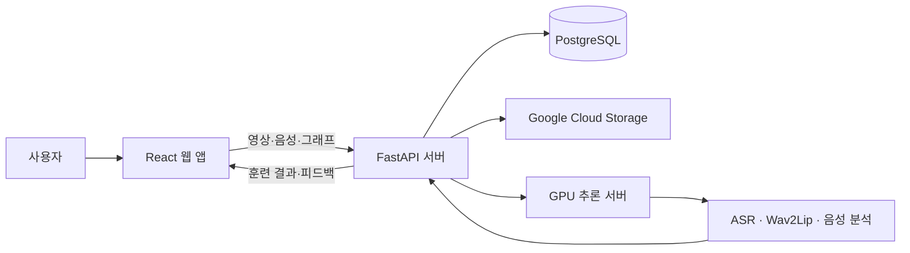

# 돋음 (Dodeum)

> 브라우저에서 발음을 녹음하고 AI 기반 피드백을 확인하며 반복 연습하는 발음 훈련 서비스

2025년 10월부터 11월까지 진행된 SSAFY 팀 프로젝트입니다. 사용자는 발성·단어·문장 훈련을 하고, 연습 기록과 피드백을 확인할 수 있습니다. 저는 프론트엔드 개발자로서 발성 훈련, 브라우저 녹음 처리, API 구조 개선을 담당했습니다.


## 주요 기능

- **발성 훈련**: MPT, 점점 크게, 점점 작게, 크게-작게, 작게-크게로 구성된 5가지 훈련 제공
- **단어·문장 훈련**: 카메라와 마이크로 훈련 과정을 녹화·녹음하고 사용자의 발음을 기준 발음과 비교
- **분석 피드백**: Praat 기반 음성 지표와 AI 분석 결과를 항목별로 제공
- **연습 기록**: 날짜별 훈련 이력과 문장별 상세 결과 조회

| 단어 녹화 | 상세 피드백 |
| --- | --- |
|  |  |

## 담당 역할과 기여

### 발성 훈련 5종 구현

브라우저의 오디오 입력부터 실시간 음량 그래프, 그래프 이미지 캡처, multipart 업로드까지 하나의 훈련 흐름으로 연결했습니다. 녹음·재생·제출 등 공통 로직은 재사용하되 훈련별 진행 방식만 분리해 5가지 발성 훈련을 구현했습니다.

- 관련 커밋: [`f2ef0ac`](https://github.com/Dreamtreeme/dodeum/commit/f2ef0ac0ade6b8aee2dce831b19258d1a3cc37db)
- 데이터 계약: [`FE/src/features/voice-training/api/SUBMISSION_FORMAT.md`](./FE/src/features/voice-training/api/SUBMISSION_FORMAT.md)

### Praat 입력 규격에 맞춘 브라우저 녹음

기존 구현은 WebM 데이터를 WAV로 변환하지 않은 채 파일 확장자만 `.wav`로 바꿔 전송했고, 이 때문에 Praat 분석 결과가 `null`로 반환됐습니다. RecordRTC로 실제 WAV 데이터를 생성하고 서버가 요구하는 모노·16 kHz 규격에 맞춰 프론트엔드와 서버 사이의 입력 규격을 바로잡았습니다.

- 관련 커밋: [`4ba04de`](https://github.com/Dreamtreeme/dodeum/commit/4ba04def41085a72ef37fce9ccd416167a9884c0)

### 프론트엔드 구조 개편과 API 호출 일원화

화면별로 흩어져 있던 코드를 9개 기능 영역으로 재구성하고, 16개 API 모듈이 공통 Axios 클라이언트를 사용하도록 정리했습니다. 인증 헤더 부착과 토큰 갱신을 공통 클라이언트에서 처리해 기능마다 반복되던 요청 코드를 줄였습니다.

- 구조 개편: [`b5bef03`](https://github.com/Dreamtreeme/dodeum/commit/b5bef03c950e486f344326e9fa4ad395bf302e02)
- API 통일: [`4281e15`](https://github.com/Dreamtreeme/dodeum/commit/4281e15196812fec8eb07f74367b3fca62e2574b)
- 인증 흐름: [`0d02925`](https://github.com/Dreamtreeme/dodeum/commit/0d02925666c99762a78429b38fca868a246d4ffe)

### 협업 과정에서 구현 범위 조정

초기에는 그래프 영상도 함께 제출할 계획이었지만, 일정과 서버 요구사항을 검토해 범위를 조정했습니다. 팀원들과 협의해 그래프를 영상 대신 이미지로 제출하고, 서버가 요구하는 핵심 데이터 전송에 집중했습니다. 이 범위 안에서 발성 훈련 5종의 전체 흐름을 완성했습니다.

## 동작 구조



## 기술 구성

| 영역 | 기술 |
| --- | --- |
| Frontend | React 19, TypeScript, Vite, Tailwind CSS, Axios, RecordRTC, MediaPipe |
| Backend | Python 3.11, FastAPI, SQLModel, PostgreSQL |
| AI·음성 | Praat-Parselmouth, Omnilingual ASR, Wav2Lip, OpenAI API |
| Infra | Docker Compose, Nginx, Jenkins, AWS EC2, Google Compute Engine, Cloud Storage |

## 로컬 실행

프론트엔드는 다음 명령으로 실행할 수 있습니다.

```powershell
cd FE
Copy-Item .env.example .env
npm install
npm run dev
```

기본 API 주소는 `http://localhost:8000/api/v1`입니다. 녹음·분석·기록 저장의 전체 흐름을 확인하려면 FastAPI, PostgreSQL, Google Cloud Storage, GPU 추론 서버를 추가로 설정해야 합니다. 전체 배포 환경은 [`exec/MANUAL.md`](./exec/MANUAL.md)에 정리돼 있습니다.

## 검증과 제한사항

```powershell
cd FE
npm run build
npm run lint
```

- 프로덕션 빌드와 ESLint 검사를 수행합니다.
- 카메라·마이크 권한 처리와 녹음 기능은 Chromium 계열 브라우저를 기준으로 구현했습니다.
- GPU 모델과 외부 API가 필요한 전체 분석 환경은 로컬 프론트엔드 실행만으로 재현되지 않습니다.
- 자동화된 프론트엔드 테스트는 추가하지 못했습니다. 대신 팀 시연 시나리오에 따라 주요 사용자 흐름을 수동으로 검증했습니다.

## 저장소 안내

- [`FE`](./FE): React 프론트엔드
- [`backend`](./backend): 인증, 훈련, 결과 저장을 담당하는 FastAPI 서버
- [`serving-server`](./serving-server): 음성·영상 추론 서버
- [`exec/시연시나리오`](./exec/시연시나리오): 주요 화면과 시연 순서

이 저장소는 팀 프로젝트 결과물을 GitHub에 공개하기 위한 복제본입니다. 팀 전체 코드가 포함되어 있으며, 앞서 링크한 커밋에서 제가 담당한 변경을 확인할 수 있습니다.
